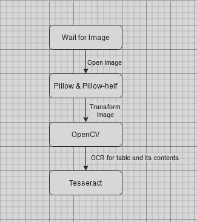

# Table to CSV

The program takes in a picture of table and it outputs the table's contents into a `.csv` file.

## Technologies Used

1. Python
2. Pillow & Pillow-HEIF
3. OpenCV
4. Tesseract (PyTesseract)
5. Some frontend library/framework (If web, probably React+MUI. If desktop, probably PyQt or Electron?)

## Expected Workflow

## Background

My friend was studying from a Chemistry textbook that emphasised the use of Excel to do data manipulation.
Since it was a physical textbook, he has to type out the data by hand which is very time consuming.

The current solutions such as ExtractTable and Nanonets don't work well for him.
Therefore, I took it upon myself to create a program to do it and to teach myself the technologies involved to make this work.

## How I learnt

I searched on YouTube on how to do OCR and I found this [playlist](https://www.youtube.com/playlist?list=PL2VXyKi-KpYuTAZz__9KVl1jQz74bDG7i).
